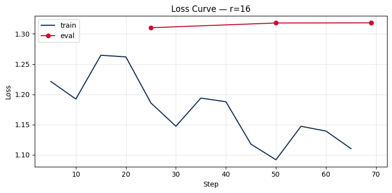

# Lab 21 - Báo cáo đánh giá

**Học viên**: Nguyễn Như Giáp - 2A202600192
**Ngày nộp**: 2026-05-07  
**Hình thức nộp**: Option B - adapter trên HuggingFace Hub

## 1. Setup

- **Base model**: `unsloth/Qwen2.5-7B-Instruct`, được load bằng Unsloth với lượng tử hóa 4-bit theo hướng QLoRA.
- **HF Hub adapter**: https://huggingface.co/NhuGiap/qwen2.5-7b-vi-lab21-r16
- **GitHub repo**: https://github.com/NhuGiap04/Day21-Track3-Finetuning-LLMs-LoRA-QLoRA.git
- **Dataset**: `5CD-AI/Vietnamese-alpaca-gpt4-gg-translated`, dùng subset 200 mẫu tiếng Việt theo format Alpaca.
- **Chia dữ liệu**: 180 mẫu train + 20 mẫu eval, random seed = 42.
- **Các cột sử dụng**: `instruction_vi`, `input_vi`, `output_vi`.
- **Phân bố độ dài token**: min = 25, p50 = 227, p95 = 562, p99 = 704, max = 738.
- **max_seq_length**: 1024, theo hard cap trong notebook.
- **GPU**: NVIDIA L4, 23.7 GB VRAM.
- **Thiết lập training**: batch size 1, gradient accumulation 8, train 3 epochs, cosine scheduler, dùng các LoRA target modules trong notebook, tắt eval-during-training để giảm áp lực VRAM.
- **Chi phí training ước tính**: khoảng **$0.06** cho **10.0 phút** tổng thời gian train, với đơn giá **$0.35/giờ**.

## 2. Kết quả thí nghiệm theo rank

Perplexity được tính bằng công thức `exp(eval_loss)`.

| Rank | Alpha | Trainable Params | Train Time | Peak VRAM | Eval Loss | Perplexity |
|---:|---:|---:|---:|---:|---:|---:|
| 8 | 16 | 2,523,136 | 3.31 phút | 11.93 GB | 1.4017 | 4.06 |
| 16 | 32 | 5,046,272 | 3.32 phút | 10.83 GB | 1.3182 | 3.74 |
| 64 | 128 | 20,185,088 | 3.35 phút | 13.24 GB | 1.3138 | 3.72 |

Quan sát chính: khi tăng rank từ 8 lên 16, perplexity cải thiện rõ rệt từ 4.06 xuống 3.74. Tuy nhiên, khi tăng tiếp từ 16 lên 64, perplexity chỉ cải thiện rất nhỏ, từ 3.7368 xuống 3.7204. Mức cải thiện này không tương xứng với việc số lượng trainable parameters tăng gấp 4 lần.

## 3. Phân tích loss curve

Notebook được chạy với eval-during-training bị tắt, nên biểu đồ loss chủ yếu phản ánh training loss thay vì cho thấy trực tiếp eval loss ở giữa quá trình train. Dựa trên final eval loss đã thu thập, tôi chưa thấy dấu hiệu overfitting nghiêm trọng: cả ba adapter đều có eval loss hợp lý, và rank lớn hơn không làm kết quả trên eval set bị suy giảm.

Tuy vậy, kết quả giữa các rank cho thấy hiện tượng diminishing returns. Rank 64 có eval loss tốt nhất, nhưng chỉ tốt hơn rank 16 một lượng rất nhỏ. Điều này cho thấy phần capacity bổ sung của rank 64 chưa được tận dụng nhiều trên subset chỉ có 200 mẫu. Nếu training loss tiếp tục giảm nhưng eval perplexity gần như không cải thiện, đó là tín hiệu thực tế rằng rank cao hơn có thể đang học thêm chi tiết của train set nhiều hơn là cải thiện khả năng tổng quát hóa.

## 4. So sánh định tính

Phần so sánh dưới đây dùng base model và adapter fine-tuned r=16. Nội dung được tóm tắt từ `results/qualitative_comparison.csv`.

| # | Prompt | Base model | Fine-tuned r=16 | Nhận xét |
|---:|---|---|---|---|
| 1 | Giải thích khái niệm machine learning cho người mới bắt đầu. | Giải thích ML là một nhánh AI, học từ dữ liệu và cải thiện mà không cần lập trình chi tiết. | Cách giải thích tương tự, diễn đạt thiên về tiếng Việt hơn và nhắc đến thuật toán/mô hình. | Cải thiện nhẹ về văn phong, cả hai câu trả lời đều chấp nhận được. |
| 2 | Viết đoạn code Python tính số Fibonacci thứ n. | Đưa ra hàm Python lặp khá hợp lệ và có ví dụ output. | Cố gắng thêm comment, nhưng output bị lỗi cú pháp/pseudo-code tiếng Việt trong đoạn Python. | Kém hơn. Fine-tuning không giúp tốt hơn ở prompt coding này. |
| 3 | Liệt kê 5 nguyên tắc thiết kế UI/UX. | Bắt đầu trả lời dạng danh sách, có nguyên tắc lấy người dùng làm trung tâm và sự đơn giản. | Cũng bắt đầu với user-centered design và giải thích tương tự về UI/UX. | Chất lượng tương đương; cả hai output bị cắt trước khi hiển thị đủ 5 nguyên tắc. |
| 4 | Tóm tắt sự khác biệt giữa LoRA và QLoRA. | Nói đúng rằng LoRA dùng low-rank updates, còn QLoRA dùng quantization để giảm bộ nhớ. | Giải thích LoRA là các lớp low-rank được train thêm và QLoRA là biến thể lượng tử hóa. | Cải thiện về cách diễn đạt trong đúng chủ đề lab, dù output bị cắt. |
| 5 | Phân biệt prompt engineering, RAG, và fine-tuning. | Định nghĩa prompt engineering và bắt đầu nói về RAG. | Trả lời có cấu trúc hơn, nêu rõ Prompt Engineering, Retrieval-Augmented Generation và fine-tuning. | Cải thiện về cấu trúc và độ liên quan. |

Nhìn chung, fine-tuning giúp model trả lời tự nhiên hơn bằng tiếng Việt và phù hợp hơn với các prompt về AI/LLM như LoRA, QLoRA, RAG và fine-tuning. Điểm yếu rõ nhất là code generation: ví dụ Fibonacci bị giảm chất lượng. Điều này cho thấy subset instruction tiếng Việt nhỏ chưa đủ để cải thiện khả năng lập trình, và thậm chí có thể làm model ưu tiên diễn giải ngôn ngữ tự nhiên hơn là giữ cú pháp code chính xác.

## 5. Kết luận về trade-off giữa các rank

Trong thí nghiệm này, **rank 16 là lựa chọn thực tế tốt nhất**. Rank 8 là adapter rẻ nhất với chỉ 2.52M trainable parameters, nhưng eval perplexity còn cao ở mức 4.06. Khi tăng từ r=8 lên r=16, số trainable parameters tăng lên 5.05M, nhưng đổi lại perplexity giảm rõ rệt xuống 3.74. Đây là bước cải thiện chất lượng lớn nhất trong toàn bộ thí nghiệm. Rank 64 đạt perplexity tốt nhất về mặt số liệu thô, khoảng 3.72, nhưng cần tới 20.19M trainable parameters, tức khoảng gấp 4 lần r=16, trong khi chỉ cải thiện perplexity thêm khoảng 0.016. Với dataset nhỏ như thí nghiệm này, mức cải thiện đó không đủ để bù cho chi phí tham số và VRAM tăng thêm.

Về cơ chế, LoRA rank quyết định lượng capacity cập nhật được thêm vào base model đã bị freeze. Rank cao hơn có thể biểu diễn các thay đổi phức tạp hơn, nhưng sau khi model đã học được các hướng thích nghi quan trọng, việc tăng rank tiếp có thể chỉ thêm capacity dư thừa. Trên subset 200 mẫu Vietnamese Alpaca, r=16 dường như đã nắm được phần lớn tín hiệu hữu ích về văn phong tiếng Việt và instruction-following. Nếu triển khai production, tôi sẽ chọn **r=16** vì chất lượng gần tương đương r=64, adapter nhỏ hơn nhiều, áp lực VRAM thấp hơn, và ROI tốt hơn giữa chi phí và chất lượng.

## 6. Những điều tôi học được

- Rank lớn hơn không tự động đồng nghĩa với model tốt hơn. Cần nhìn vào mức cải thiện chất lượng trên mỗi lượng trainable parameters tăng thêm.
- Với dataset instruction nhỏ, r=16 có thể đã đủ để học phong cách trả lời và thuật ngữ domain, trong khi r=64 cho thêm rất ít lợi ích.
- Cần kết hợp cả quantitative evaluation và qualitative prompts. Perplexity nghiêng nhẹ về r=64, nhưng ví dụ định tính cho thấy adapter tốt nhất vẫn có thể thất bại ở prompt coding.
